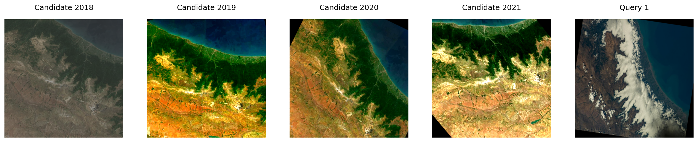

# Modified EarthLoc 

## Huggingface [Demo](https://huggingface.co/spaces/pawlo2013/EarthLoc2)

In this repository we modify the [EarthLoc](https://arxiv.org/pdf/2403.06758) code with improvemnets from [AstroLoc](https://arxiv.org/pdf/2502.07003). More specifically the improvements include

### Dinov2

In `./apl_models` we add `apl_model_dinov2.py` which add support for using the Dinov2 backbone as the feature extractor, we support three models `small` `base` `big`. For example to finetune a small Dinov2 with where only one block (counting from the last) is unfrozen backbone run 
`python train.py --model Dinov2 --model_type small --num_of_layers_to_unfreeze 1`. All checkpoints use the register [versions](https://arxiv.org/pdf/2309.16588) see Dinov2 [code](https://github.com/facebookresearch/dinov2). 
 

#### Aggregators (SALAD, MixVPR)

We add support for the [SALAD](https://github.com/serizba/salad) aggregator to include it simply run `python train.py --model Dinov2 --model_type small --num_of_layers_to_unfreeze 1 --aggregator_type SALAD`. When using the SALAD the output embedding dimension is `2048,3072,4096` for `small,base,big` Dinov2 checkpoints respecively. You can additionnaly use the [MixVPR](https://github.com/amaralibey/MixVPR) aggregator. 

#### Query Data

We add the queries which are not part of the tests sets (from EarthLoc) to form contrastive pairs during training. The file `./data/candidate_to_queries_with_db_2021_iou_0.50.pt` contains the paths to queries not in test sets which have an IOU>0.5 with each candidate. For each batch one query for each candiate is chosen and added to the batch see the figure below for demonstration. You can also pass a different thresholds as argument to the `train.py` we support `0.25` and `0.00` however when using lower thresholds the results were subpotimal. See `query_mining.py` for the exact changes. To use query data add `--query_mining` to `train.py`
 
 

This forces the formation of `query, candidate` pairs making the model robust to differences in tilt, cloud occlusions, temporal differences. We keep the standard [multi similrarity minining and loss](https://github.com/msight-tech/research-ms-loss). We do not recommend fetching more than one query per candidate we found that this hinders the results as it allows to form `query,query`  pairs which are not useful for the final retrieval task. 


### Results 


For detailed results for each of the additions see [Results](./documentation/results.md).


### Additional scripts 

In `./scripts` we inlude `create_database_faiss_index.py` which create the FAISS index for a given model. Additional scripts for creating candidate to query mapping with variable thresholds are included too (`scripts/filter_queries_not_in_validation_and_test.py`,`scripts/invert.py`) . Additionnaly a script for creating csv file mapping FAISS indicies to the paths of the files is included (`scripts/create_url_mapping.py`). 

### Notebooks

Directory `./notebooks` includes notebooks used for data visualisation. 


### Model weights

We realese the [weights](https://huggingface.co/pawlo2013/EarthLoc2) for the best model i.e Dinov2 base + SALAD + Query data. Additionnaly we release the FAISS [index](https://huggingface.co/datasets/pawlo2013/EarthLoc2_FAISS) used by encoding all of the 2021 images. Morover we release the sharded dataset of candidate images from the year [2021](https://huggingface.co/datasets/pawlo2013/EarthLoc_2021_Database). All of these files in conjunction allow for inference of the pipeline see the [HF space](https://huggingface.co/spaces/pawlo2013/EarthLoc2) on a working implementation. 


### How to reproduce? 

To reproduce the best model run
`train.py --model Dinov2 --model_type base --iterations_per_epoch 250 --num_epochs 20 --brightness 0.4 --mine_queries --aggregator_type SALAD`, for each of the other cases from [results](./documentation/results.md) simply replace `--model_type` `--mine_queries` `--aggregator_type`, while keeping the rest of the arguments the same.  


# EarthLoc
Code for CVPR 2024 paper "EarthLoc: Astronaut Photography Localization by Indexing Earth from Space".
The paper introduces the task of Astronaut Photography Localization (APL) through image retrieval.

[[ArXiv](https://arxiv.org/abs/2403.06758)] [[BibTex](https://github.com/gmberton/EarthLoc?tab=readme-ov-file#cite)]

<p  align="center">
  
</p>


## Setup
Clone the repo, install packages, and download the queries and database images as such
```
git clone https://github.com/gmberton/EarthLoc
cd EarthLoc
pip install -r requirements.txt

python data/database_downloader.py
python data/queries_downloader.py
```
This will download all required images within the directory `data`.
Each image filename contains its metadata, according to this format:
`
@ lat1 @ lon1 @ lat2 @ lon2 @ lat3 @ lon3 @ lat4 @ lon4 @ image_id @ timestamp @ nadir_lat @ nadir_lon @ sq_km_area @ orientation @ .jpg
`

Where the first 8 fields are the latitudes and longitudes of the 4 corners of the image (i.e. the footprint). `nadir_lat` and `nadir_lon` are the position of nadir (which corresponds to the center of the footprint in database images, but can be thousands of kilometers aways from the footprint for queries).

For database images, `image_id` corresponds to zoom, row, column (according to WMTS).
For query images, `image_id` corresponds to mission, roll, frame, which are a unique identifier of ISS photographs.

`sq_km_area` is the footprint covered area in squared kilometers, and `orientation` is the orientation of the image from 0 to 360° (e.g. 0° means that the image is north-up, like a normal map): orientation is always 0° for database images.


After the images are downloaded, download the file containing the intersections between queries and database images (it would be too heavy to compute online at the beginning of every experiment) [at this link](https://drive.google.com/file/d/169X9TnrWpdFy4WQpyBZ9DBFUwOb7Nl5F/view?usp=drive_link) and put it in `data/queries_intersections_with_db_2021.torch`.
This file used for inference, to see if the predictions are correct.

## Train
Once the dataset is downloaded, simply run
```
python train.py
```
or
```
python train.py -h
```
to see the possible hyperparameters.


## Trained model

Available [here](https://drive.google.com/file/d/1NJUVZm6-JncHRR01pjj4QjWNYjcLbIzm/view?usp=drive_link)


## Cite
Here is the bibtex to cite our paper
```
@InProceedings{Berton_CVPR_2024_EarthLoc,
    author    = {Berton, Gabriele and Stoken, Alex and Caputo, Barbara and Masone, Carlo},
    title     = {EarthLoc: Astronaut Photography Localization by Indexing Earth from Space},
    booktitle = {Proceedings of the IEEE/CVF Conference on Computer Vision and Pattern Recognition (CVPR)},
    month     = {June},
    year      = {2024},
}
```
